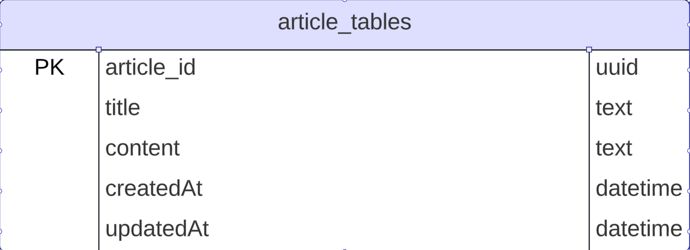

## Description

This page serves as the central hub for our help center, providing users with access to a wealth of informative articles. With its intuitive search functionality, users can easily find the articles they need to address their questions or concerns. Additionally, the help center page implements rate limiting on its search endpoints.

## Acceptance Criteria

- Articles are being sent on page load.
- Articles can be searched for.
- Rate limiting is set on search endpoints.

### Requirements

- [ ] Articles are returned on page load.
- [ ] Articles can be searched for.
- [ ] Rate limiting is set.

## Endpoints

### Get All Topics [GET] `/api/v1/topics`

1. Endpoint Flow

- This endpoint runs by default on page load, and queries the database for all the topics in the `articles_table` table.

Request

```
[GET] /api/v1/topics
```

Successful Response `200`

```
{
    "success": true,
    "message": String,
    "topics": [
        {
            "article_id": Int,
            "title": String,
            "content": String,
        }
        ...
    ]
}
```

Error Response `500`

```
{
    "success": false,
    "message": String,
    "statusCode": 500
}
```

<br />

### Search for topics

1. Endpoint `/api/v1/topics` will accept query parameters that would be queried across the `topic's title` column.
   <br/>
2. If debouncing is not setup on the frontend, rate limiting error should be thrown.
   <br />

Request

```
[GET] /api/v1/topics/search?title={title}

query param - title
```

Successful Response: `200`

```
{
    "success": true,
    "message": String,
    "topics": [
        {
            "article_id": Int,
            "title": String,
            "content": String,
        },
        ...
    ]
}
```

Error Response: `404`
No article matching the title search param.

```
{
    "success": false,
    "message": String,
    "statusCode": 404
}
```

Error Response: `429`
Too many requests, implement debouncing.

```
{
    "success": false,
    "message": String,
    "statusCode": 429
}
```

Error Response: `500`
Internal Server Error

```
{
    "success": false,
    "message": String,
    "statusCode": 500
}
```

## Database Schema

**Table name: articles_table**

_article_id:_

- constraints: string(uuid), unique, primary-key, not null

_title:_

- constraints: string, unique, not null, text

_content:_

- constraints: string, not null, text

_createdAt:_

- constraints: datetime

_updatedAt:_

- constraints: datetime

### Database diagram



### Testing

1. Unit Tests

- The systems should have unit tests covering rate limit check.

- The return data for the `/api/v1/topics` matches the documentation.
